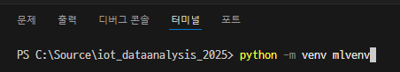
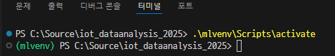
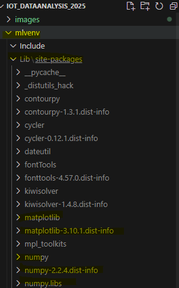

# iot_dataanalysis_2025
2025iot개발자과정 -빅데이터분석,머신러닝, 딥러닝

## 46일차(4월 8일)
#### 머신러닝/딥러닝
- 인공지능
- 머신러닝
    - 인공지능 하위집합
    - 통계적 방법, 기계학습
- 딥러닝
    - 머신러닝 하위집합
    - 신경망

#### 개발환경
##### 코랩
- 구글에서 만든 온라인 주피터 노트북 개발 플랫폼
- 구글 드라이브 연동, 구글 서버 하드웨어 사용
    - 드라이브 ColabNoteBooks 폴더에 저장
- 런타임 유형
    - CPU, T4 GPU, V2-8 TPU - 무료
    - A100 GPU, L4 GPU, VSE-1 TPU - 유료

##### VSCode
- 로컬 환경 직접 설정
- 사이킷런, 텐서플로, 쿠다, 파이토치...

##### 파이썬 가상환경
- 터미널에서 아래 코드 입력 후 엔터 누르면 왼쪽 탐색기에 생성됨
```shell
>python -m venv mlvenv
```


- 가상환경 사용
```shell
>.\mlvenv\Scripts\activate
```


- .gitignore에 /mlenv 추가 후 .gitignore만 깃허브 우선 commit push
    - 사용자가 만든 가상환경의 경우, 가상환경은 깃허브에 올라가지 않도록 처리


https://github.com/user-attachments/assets/205c08f0-3ec6-47ee-9422-d52533350b81


- matplotlib 설치
```shell
pip install matplotlib
```



- matplotlib 한글깨짐 방지 위한 코드- 주피터노트북할 때마다 제일먼저 실행
```python
from matplotlib import rcParams, font_manager, rc

font_path = 'C:/Windows/Fonts/malgun.ttf' # 나눔고딕코딩 사용, 나눔고딕에서 오류발생(!)
font = font_manager.FontProperties(fname=font_path).get_name() # 실제 설치된 폰트 이름조회
rc('font', family=font) # 한글깨짐현상 해결!!
rcParams['axes.unicode_minus'] = False # 한글 사용시 마이너스 표시 깨짐 해결!
```

- 시본 모듈(matplotlib 하위 모듈) 설치
```shell
pip install seaborn
```

- 사이킷런 설치
```shell
pip install scikit-learn

```


- 텐서플로우 설치
```shell
pip install tensorflow==2.15.0

```
#### 첫번째 머신러닝 [JupyterNoteBook](./day46/mldl01_도미빙어분류.ipynb)
- 캐글 생선 데이터
    - https://www.kaggle.com/datasets/vipullrathod/fish-market
- 길이를 보고 도미(beam)인지 빙어(smelt)인지 판별
- 이진분류
- ctrl shift p 눌러서 주피터노트북 만들기, 주피터 노트북 저장 

#### 지도 학습 /비지도 학습
- 지도학습(Supervised Learn) - 데이터->`입력` , 정답 ->`타겟` => 훈련데이터(training data)
    - 입력 - 특성(길이, 무게...)
    - 입력과 타겟을 모두 주어서 훈련을 시키는 것
- 비지도학습(Unsupervised Learn) - 입력만 존재하고 타겟이 없이 훈련하는 것
- 강화학습(Reinforcement Learn) - 선택가능한 행동 중 보상과 처벌 등으로 최적의 행동양식 학습하는 것

##### 훈련세트/테스트 세트
-`훈련`세트 - 모델을 훈련시키기 위한 데이터
-`테스트`세트 - 훈련 후 모델이 예측을 제대로 하는지 테스트 하는 데이터
- 전체 데이터 70~80퍼센트 분리 후 훈련 세트로, 20~30퍼센트를 테스트 세트로 사용

##### 샘플링 편향   [JupyterNoteBook](./day46/mldl02_훈련테스트세트.ipynb)
- 샘플링 편향
    - 49개 데이터를 7:3으로 분리하면 
    - 34마리가 전부 도미로 훈련 세트
    - 1마리 도미 + 14마리 빙어로 테스트 세트
- 위 문제를 해결하기 위해서 데이터를 랜덤하게 섞어 줌
    ```python
    np.random.seed(38)
    index = np.arange(49)   
    np.random.shuffle(index) 
    ```
#### 넘파이
- 수학 라이브러리 일종, 배열처리 쉽게 도와주기 위해 개발
- 2차원 배열이상 고차원 배열 조작 처리 간편한 도구


## 47일차(4월 9일 수요일)
### 빅데이터에 필요한 모듈 [노트북](./day47/mldl01_주요모듈학습.ipynb)
- Matplotlib(차트), Numpy(배열), Pandas(데이터 조작), Seaborn(차트 꾸미기), Folium(지도)
- Faker(더미데이터 생성)

### 데이터 전처리
### 선형회귀
### 로지스틱회귀
### 확률적 경사하강법
### 인공신경망
### 심층신경망
### 합성공 신경망
### 순차데이터와 순환신경망


