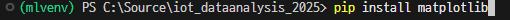

# 마크다운 표 만들기
```python
|레이블|0|1|2|3|4|5|6|7|8|9|
|:---|:---:|:---:|:---:|:---:|:---:|:---:|:---:|:---:|:---:|:---:|
|패션MNIST|티셔츠|바지|스웨터|드레스|코트|샌들|셔츠|스니커즈|가방|앵클부츠
```


# iot_dataanalysis_2025
2025iot개발자과정 -빅데이터분석,머신러닝, 딥러닝

## 46일차(4월 8일)
#### 머신러닝/딥러닝
- 인공지능
- 머신러닝
    - 인공지능 하위집합
    - 통계적 방법, 기계학습
- 딥러닝
    - 머신러닝 하위집합
    - 신경망

#### 개발환경
##### 코랩
- 구글에서 만든 온라인 주피터 노트북 개발 플랫폼
- 구글 드라이브 연동, 구글 서버 하드웨어 사용
    - 드라이브 ColabNoteBooks 폴더에 저장
- 런타임 유형
    - CPU, T4 GPU, V2-8 TPU - 무료
    - A100 GPU, L4 GPU, VSE-1 TPU - 유료

##### VSCode
- 로컬 환경 직접 설정
- 사이킷런, 텐서플로, 쿠다, 파이토치...

##### 파이썬 가상환경
- 터미널에서 아래 코드 입력 후 엔터 누르면 왼쪽 탐색기에 생성됨
```shell
>python -m venv mlvenv
```


- 가상환경 사용
```shell
>.\mlvenv\Scripts\activate
```


- .gitignore에 /mlenv 추가 후 .gitignore만 깃허브 우선 commit push
    - 사용자가 만든 가상환경의 경우, 가상환경은 깃허브에 올라가지 않도록 처리


https://github.com/user-attachments/assets/205c08f0-3ec6-47ee-9422-d52533350b81


- matplotlib 설치
```shell
pip install matplotlib
```



- matplotlib 한글깨짐 방지 위한 코드- 주피터노트북할 때마다 제일먼저 실행
```python
from matplotlib import rcParams, font_manager, rc

font_path = 'C:/Windows/Fonts/malgun.ttf' # 나눔고딕코딩 사용, 나눔고딕에서 오류발생(!)
font = font_manager.FontProperties(fname=font_path).get_name() # 실제 설치된 폰트 이름조회
rc('font', family=font) # 한글깨짐현상 해결!!
rcParams['axes.unicode_minus'] = False # 한글 사용시 마이너스 표시 깨짐 해결!
```

- 시본 모듈(matplotlib 하위 모듈) 설치
```shell
pip install seaborn
```

- 사이킷런 설치
```shell
pip install scikit-learn

```


- 텐서플로우 설치
```shell
pip install tensorflow==2.15.0

```
#### 첫번째 머신러닝 [JupyterNoteBook](./day46/mldl01_도미빙어분류.ipynb)
- 캐글 생선 데이터
    - https://www.kaggle.com/datasets/vipullrathod/fish-market
- 길이를 보고 도미(beam)인지 빙어(smelt)인지 판별
- 이진분류
- ctrl shift p 눌러서 주피터노트북 만들기, 주피터 노트북 저장 

#### 지도 학습 /비지도 학습
- 지도학습(Supervised Learn) - 데이터->`입력` , 정답 ->`타겟` => 훈련데이터(training data)
    - 입력 - 특성(길이, 무게...)
    - 입력과 타겟을 모두 주어서 훈련을 시키는 것
- 비지도학습(Unsupervised Learn) - 입력만 존재하고 타겟이 없이 훈련하는 것
- 강화학습(Reinforcement Learn) - 선택가능한 행동 중 보상과 처벌 등으로 최적의 행동양식 학습하는 것

##### 훈련세트/테스트 세트
-`훈련`세트 - 모델을 훈련시키기 위한 데이터
-`테스트`세트 - 훈련 후 모델이 예측을 제대로 하는지 테스트 하는 데이터
- 전체 데이터 70~80퍼센트 분리 후 훈련 세트로, 20~30퍼센트를 테스트 세트로 사용

##### 샘플링 편향   [JupyterNoteBook](./day46/mldl02_훈련테스트세트.ipynb)
- 샘플링 편향
    - 49개 데이터를 7:3으로 분리하면 
    - 34마리가 전부 도미로 훈련 세트
    - 1마리 도미 + 14마리 빙어로 테스트 세트
- 위 문제를 해결하기 위해서 데이터를 랜덤하게 섞어 줌
    ```python
    np.random.seed(38)
    index = np.arange(49)   
    np.random.shuffle(index) 
    ```
#### 넘파이
- 수학 라이브러리 일종, 배열처리 쉽게 도와주기 위해 개발
- 2차원 배열이상 고차원 배열 조작 처리 간편한 도구


## 47일차(4월 9일 수요일)
### 빅데이터에 필요한 모듈 [노트북](./day47/mldl01_주요모듈학습.ipynb)
- Matplotlib(차트), Numpy(배열), Pandas(데이터 조작), Seaborn(차트 꾸미기)
- Folium(지도)
- Faker(더미데이터 생성)

### 데이터 전처리  [노트북](./day47/mldl02_데이터전처리.ipynb)
- 머신러닝/딥러닝 이전에 데이터 가공
- 넘파이 배열
```python
fish_data = np.column_stack((fish_length, fish_weight))
```
- 사이킷런 훈련세트, 테스트세트
```python
from sklearn.model_selection import train_test_split
train_input, test_input, train_target, test_target  = train_test_split(

    fish_data, fish_target, random_state= 42 , test_size=0.3 , stratify=fish_target
)
```
- 표준점수 스케일링
```python
#axis=0은 **열 방향 (세로 방향)**을 의미합니다. 즉, 각 열에 대해 평균을 구하는 것입니다.

mean =np.mean(train_input, axis=0)           
std = np.std(train_input, axis = 0)

train_scaled = (train_input - mean) / std
test_scaled = (test_input - mean)/std
scaled_data =([25,150] - mean)/std


distances, indexes = kn.kneighbors([scaled_data])

plt.scatter(train_scaled[:,0], train_scaled[:,1], label='훈련세트')
plt.scatter(scaled_data[0] , scaled_data[1], marker='^', label='예측데이터')
plt.scatter(train_scaled[indexes,0] , train_scaled[indexes, 1], marker='D', label='최근접데이터')
plt.scatter(test_scaled[:,0], test_scaled[:,1], label='테스트세트')
plt.xlabel('도미/빙어 길이(표준화)')
plt.ylabel('도미/빙어 무게(표준화)')
plt.legend() # 범례 표시
plt.show()

```
- 표준스케일러 모듈 사용
```python
from sklearn.preprocessing import StandardScaler

scaler = StandardScaler()

train_input2 = scaler.fit_transform(train_input)
test_input2 = scaler.fit_transform(test_input)


kn2 = KNeighborsClassifier()
kn.fit(train_input2, train_target)
kn.score(test_input2, test_target)

kn.predict([scaled_data])
```
### 선형회귀  [노트북](./day47/mldl03_선형회귀.ipynb)
- 회귀 : 두 변수 사이의 상관관계를 분석하는 방법
    - 임의의 수치를 예측하는 문제
- 과대적합 - overfit , 모델 훈련세트 성능이 테스트세트 성능보다 훨씬 높을 때
- 과소적합 - underfit , 훈련세트 성능 낮거나, 테스트세트 성능이 너무 높을 때


- K-최근접 알고리즘의 문제점
    - 최근접 데이터 3개의 무게의 평균값이 1033.33333이 길이 50cm인 농어의 예측무게 1033.3333이다.
    - 길이 80cm인 농어의 예측값 또한 1033.3333이다. 최근접 데이터 3개가 동일하므로 
    ```python
    from sklearn.neighbors import KNeighborsRegressor
    knr = KNeighborsRegressor(n_neighbors=3)
    knr.fit(train_input, train_target)
    knr.score(test_input , test_target)
    
    knr.predict([[50,]])  # array([1033.33333333])
    knr.predict([[80,]])    # array([1033.33333333])
    ```
- 선형회귀 중 직선(1차방정식)의 문제점
    - 길이를 넣었을 때, 물고기 무게의 예측값이 음수가 나온다.
    ```python
    from sklearn.linear_model import LinearRegression
    lr = LinearRegression()
    lr.fit(train_input, train_target)
    lr.score(test_input, test_target)
    print(lr.coef_, lr.intercept_)  # [39.01714496] -709.0186449535474


    lr.predict([[50,]])  #array([1241.83860323])
    lr.predict([[10,]])  # array([-318.84719532])
    ```
## 48일차(4월 10일 목요일)
### 선형회귀 중 다항회귀
#### 선형회귀 중 단항회귀 문제점
- 예측값이 음수가 나오는 경우가 발생함.
#### 다항회귀  [노트북](./day47/mldl03_선형회귀.ipynb)
- 단항회귀 문제를 해결
- 무게 = a x 길이^2 + b  x 길이  + c
    - 회귀선이 곡선으로 표현

#### 특성 공학
- 훈련시킬 특성이 모자랄 때 기존 특성을 조합해서 새로운 특성을 만드는 과정
- `sklearn.preprocessing.PolynomialFeatures`를 사용해서 특성을 추가
- `하이퍼파라미터`  - 머신러닝, 딥러닝에서 학습하지 않는 파라미터
    - 사람이 직접 지정하는 값
    - random_state , learning_rate, ...

### 로지스틱회귀   [노트북](./day48/mldl01_로지스틱회귀시그모이드.ipynb)
- 로지스틱 회귀는 선형 회귀와 유사하지만, 출력값이 확률로 변환된다는 점에서 다릅니다. 선형 회귀는 연속적인 수치를 예측하지만, 로지스틱 회귀는 결과가 0과 1 사이의 값(확률)이 되도록 조정됩니다. 이를 위해 시그모이드 함수(또는 로지스틱 함수)를 사용합니다.
- 선형(다항)회귀 - 특성을 입력해서 타겟값을 예측
- 로지스틱 회귀 - K-NN 분류처럼 분류 알고리즘
    - 분류를 확률로 예측
- k-최근접 이웃 분류 알고리즘
    - 다중 분류가 어려움 (클래스 수가 많아질수록 노이즈, 계산량, 불균형 문제 등이 겹치면서 성능이 떨어질 수 있음.)
    - 범위를 벗어난 데이터는 예측에 불리

- 선형 방정식으로 학습 
    - 무게, 길이, 대각선 길이, 높이, 두께 특성
    - z = a x 무게 + b x 길이 + c x 대각선길이 + d  x 높이 + e x 두께 + f
    - z: 0~1(0~100%)
    - 실습 순서
        1. 데이터 준비(pandas load/fishdata, fishtarget)
        2. 훈련세트/테스트세트 분리, 스케일링, 도미빙어만 추출
        3. 로지스틱회귀 훈련 및 테스트(fit, score)
        4. 가중치, 계수 , decisions(decision_function())
        5. 로지스틱회귀 분류방법 2가지(predict_._porba(), 시그모이드함수expit())
            
        6. 규제, 반복횟수
        7. 로지스틱회귀 분류방법 1가지 추가(소프트맥스함수softmax())
#### 활성화함수
- 활성화함수 - 입력신호를 출력신호로 변환시켜주는 함수
    - `시그모이드 함수` - z가 아주 큰 음수일 때 0으로 , z가 아주 큰 양수일 때 1로 바꿔주는 함수. **이진분류**
        
    - `소프트맥스함수` - **다중분류**에서 z값을 확률로 만들어주는 함수
#### 머신러닝이 많이 활용되는 분야
- 인터넷쇼핑/이커머스
    - 추천시스템: 유저 행동을 분석해서 상품추천
    - 가격최적화: 수요에 맞게 가격을 자동 조정
    - 고객이탈예측: 고객이 언제 서비스를 떠날지 예측하고 방지

- 금융서비스 범죄쪽 예측
    - 신용점수 평가, 이상거래 탐지, 보험사기 예측
    - 핀테크
- 제조/공정 자동화(스마트팩토리)
    - 불량품탐지(Vision) : 카메라이미지로 실시간 불량 예측
    - 예지보전 : 기계 고장을 사전에 예측, 미리 수리
    - 생산최적화: 공정을 손봐서 품질 향상 자동화
- 의료/헬스케어
    - 질병예측
    - 의료영상분석: CT, MRI 자동 종양탐지
- 자율주행/로봇
    - 객체인식 및 추적 : 카메라, 라이다로 차량 , 사람 인식
    - 경로 계획 : 최적 주행경로 계산
    - 행동예측 : 앞차나 보행자의 움직임을 예측
- 보안
    - 침입탐지시스템, 악성코드 분류, 화재인식..

### 확률적 경사하강법 [노트북](./day48/mldl02_손실함수와확률적경사하강법.ipynb)


- `확률적 경사하강법(Stochastic Gradient Descent :SGD)`
    - 데이터가 너무 많을 때 시간 절약
    - 지역 최소점 문제 해결
    - 데이터가 계속 쌓이면, 이전 모델에 사용된 데이터 필요하고 새 데이터도 필요
    - 모든 데이터로 학습을 하면 시간이 낭비

- SGD 설명 정리
    - 머신러닝이 하나의 문제를 예측하고
    - 정답과 비교해서 얼마나 틀렸는지 확인한 다음
    - 살짝 방향을 틀어서 다음에는 덜 틀리게 만드는 방법

- `에포크`(epoch)
    - SGD로 훈련세트를 한번 다 사용한 과정

- 경사하강법 종류
    - `확률적 경사하강법`: 주어진 간격대로 1개씩 꺼내서 하강시키는 방법
        - 배치크기 1(한 개의 샘플로 손실 계산), 빠름, 
        - sklearn에서는 이것만 지원
    - `미니배치 경사하강법`: `배치`(한번에 사용하는 데이터 묶음)로 꺼내서 하강시키는 방법
  
        - 배치크기 32, 64, 128
        - 빠름, 안정적, GPU 처리 적합
    - `배치` 경사하강법 : 필요한 데이터를 몽땅 한번에 꺼내서 하강시키는 방법
        - 메모리를 많이 사용, 느림

#### 손실함수 [노트북](./day48/mldl02_손실함수와확률적경사하강법.ipynb)
- 얼마나 틀렸는지 점수를 매기는 도구
    - 내 에측이 얼마나 틀렸는지 숫자로 계산하는 것
    - 손실값(벌점)
- `손실함수` - 머신러닝 알고리즘이 얼마나 엉터리인지 측정하는 기준함수
    - 값이 가장 최소일 때 오류가 제일 적음
    - 로지스틱 손실함수(이진 크로스엔트로피) 또는 로그 손실
     
        - y : 실제 정답 (0 또는 1)
        - $ \hat{y}$  : 예측 확률 (0~1 사이)

        - 정답이 1일 때 (y=1)
            - 예측이 1에 가까우면 ->손실 작음
            - 예측이 0에 가까우면 ->손실 큼
        - 정답이 0일 때 (y= 0 )
            - 예측이 1에 가까우면 ->손실 큼
            - 예측이 0에 가까우면 ->손실 작음

    - 크로스엔트로피 손실함수
    

## 49일차(4월 11일 금요일)
### 교차검증과 그리드 서치
- 교차검증
    - 기본적으로 훈련세트와 테스트세트로 나눠서 훈련과 확인을 수행
    - 테스트세트를 사용하지 않으면 과대적합, 과소적합을 판단하기 어려움
    - 원본데이터를 8:2 또는 7:3으로 훈련세트와 테스트세트로 분리

- `검증세트`  : 테스트세트를 사용하지 않고도 적합측정하는 기법에 사용하는 데이터세트
    
    - 원본에서 8:2로 훈련세트와 테스트세트로 나눈 뒤
    - 훈련세트 10%를 검증세트로 다시 분리
    - 데이터를 훈련 세트 / 검증 세트 / 테스트 세트로 나누어서,
        모델을 훈련할 때는 훈련 세트만 사용하고,
        모델이 잘 학습됐는지 확인하기 위해 검증 세트를 사용해요.
        
- 교차검증
    - 검증세트 만들면서 훈련세트 데이터 수가 줄어듬
    - 검증세트를 떼어내어 검증(평가)하는 과정을 여러번 반복하는 것
    
    - sklearn.model_selection.cross_vaildate, sklean.model_selection.StratifiedKFold 사용
    - 데이터를 여러 조각으로 나눠서,각 조각을 번갈아가며 검증 세트로 사용하는 방식이에요.
    - 가장 많이 쓰는 건 K-겹 교차검증 (K-Fold Cross-validation)
    - 데이터가 적을 때 유리함 (모든 데이터를 여러 번 활용하니까!)
    - 여러 번 학습해야 해서 시간이 오래 걸림
    
- 그리드서치
    - 하이퍼파라미터 : 인공지능 처리 시 사용자(개발자)가 직접 지정해야 되는 값
        - 랜덤시드, 반복횟수, 손실함수, 훈련률 ...
    - AutoML: 하이퍼파라미터를 기계가 직접 처리하는 머신러닝
    - 하이퍼파라미터를 편리하게 관리해주는 도구
    
### 딥러닝, 인공신경망 [노트북](./day49/mldl01_딥러닝_인공신경망.ipynb)
- 딥러닝 : 인간의 뇌를 모방하여 훈련시키는 머신러닝 기법
    - 이미지, 영상, 음성, 텍스트 처리에 뛰어난 성능 발휘
- 인공신경망 : ANN(Artificial Neural Network)
- 밀집층 : 가장 간단한 인공신경망, 1개의 Layer를 의미
- Fashion MNIST 사용해서 실습

### 심층신경망 [노트북](./day49/mldl02_딥러닝_심층신경망.ipynb)
- 심층신경망 : DNN(Deep Neural Network)
- 2개 이상의 밀집층으로 구성된 인공신경망
- 은닉층 : hidden layer, ReLu 활성화 함수 사용
- 옵티마이저 : 신경망의 가중치, 절편을 제대로 학습하기 위한 알고리즘. Adam클래스 사용
- 드롭아웃 : 일부 뉴런을 꺼서 훈련을 덜 시키는 것. 과대적합 방지
- 콜백 : 훈련 도중 다른일을 수행하고자 할 때

## 50일차(4/14 월요일)
### 합성곱 신경망 [노트북](./day50/mldl01_합성곱신경망.ipynb)
- CNN(Convouution Neural Network)
    - 필터로 도장을 찍듯이 특성을 뽑아내어 사이즈를 줄여가며 훈련을 하는 신경망

- 기본용어
    - 커널(필터) - 입력에 곱하는 가중치 도장 , 뉴런의 개수를 필터라고 부름
    - 특성맵  - 합성곱 계산(각 커널과 입력을 곱한 출력)으로 구해진 출력값

    
- 각각의 가중치로 특성맵을 여러번 생성
    

- 기본용어
    - 패딩 - 입력이미지 테두리로 0을 채워서 , 합성곱계산 후로 입력과 동일한 사이즈의 특성맵을 만드는 방법. 0을 채우는 걸 세임 패팅, 순수 입력으로 합성곱하는 걸 밸리드 패딩
    - 스트라이드 - 커널 도장을 찍는 이동크기. 보통 1로 하고 2이상으로 하면 세임패딩을 하더라도 특성맵의 사이즈가 줄어듬
    - 풀링 - 만들어진 특성맵의 크기를 줄이는 작업 . 보통 최대풀링을 많이 사용
     
     
     
- 합성곱신경망 전체 구조
    

- fashionMNIST 이미지 처리시 머신러닝 로지스틱 회귀 분류로도 가능하고
- 딥러닝 기본 신경망으로도 가능했음
- 합성곱 신경망으로 훈련하고 예측하는 것이 좀더 정확도 높음
### 파이토치 환경설정 [노트북](./day50/mldl02_파이토치시작.ipynb)

## 51일차(4/15 화요일)
### 파이토치 기본학습
### 파이토치 실습

### 토이프로젝트


### 순차데이터와 순환신경망


